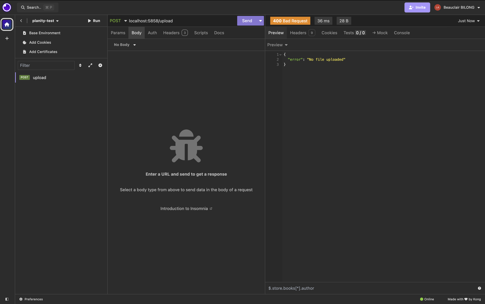
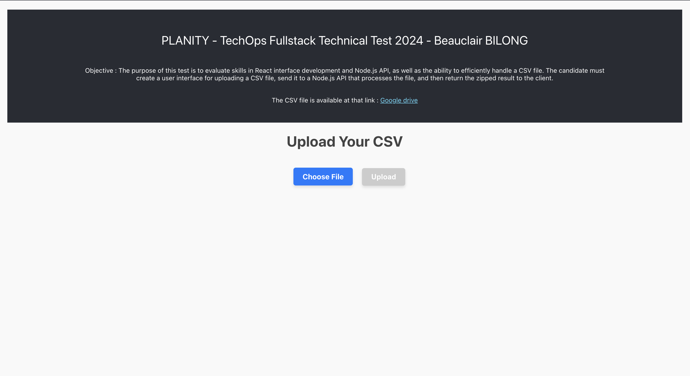
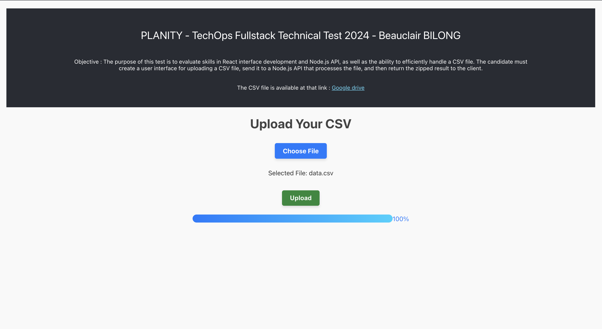

# PLANITY - TechOps Fullstack Technical Test 2024

#### Objective : The purpose of this test is to evaluate skills in React interface development and Node.js API, as well as the ability to efficiently handle a CSV file. The candidate must create a user interface for uploading a CSV file, send it to a Node.js API that processes the file, and then return the zipped result to the client.

#### The CSV file is available at that link : [Google Drive](https://drive.google.com/file/d/1MG0MoczOYM-UoFsEQN8ThRyyG3aH4v4Y/view?usp=sharing)

## Installation

### 1. Requirements (MacOS installation)

#### 1.1 Homebrew

Install and update Homebrew

```shell
/bin/bash -c "$(curl -fsSL https://raw.githubusercontent.com/Homebrew/install/HEAD/install.sh)"
brew update
```

#### 1.2 NVM/Node (latest 20)

Install NVM/Node

```shell
brew install nvm
```

then use node 20 (latest)

```shell
nvm install 20
nvm use 20
```

#### 1.3 Yarn

Install yarn

```shell
brew install yarn
```

### 2. Install the repository

#### 2.1 Clone the repository

```shell
git clone https://github.com/bbilong/planity-test.git
cd planity-test
```

#### 2.2 Install Client

```shell
cd client
yarn install
```

#### 2.3 Install Server

```shell
cd server
yarn install
```

### 3. Start your local

#### 3.2 [BACK] Launch server

```shell
cd server
yarn start
```

Then open your API call tools (like Insomnia or Postman) and call this url in POST without body [localhost:5858/upload](localhost:5858/upload)



#### 3.2 [FRONT] Launch client

```shell
cd client
yarn start
```

Then go to [http://localhost:3000/](http://localhost:3000/)





## Project Structure

```
|- client // React App
|  - public
|  - src  // All the source code
|    |- components
|
|- server // Nodejs API
|  |- src  // All the source code
|     |- app
|     |- middlewares
|     |- modules
|     |- utils
```